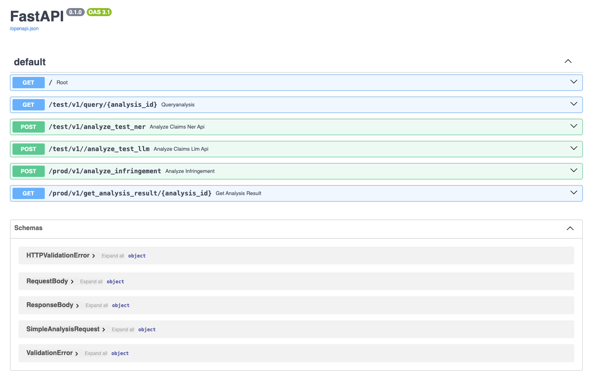

# Introduction
<style>
r { color: Red }
o { color: Orange }
g { color: Green }
</style>

This Patent-infring-API is backend service in python code. 
It provides the Restful APIs for front-end to consume.

## 1. API

- <g>POST:</g> **/prod/v1/analyze_infringement**
  - recieve the request and respond with json which contains the ananlysis id hashed by all fields of request JSON] 
  - immediatedly return the response
  - put the request into backend queue waiting another thread to process

  ```json
  Input JSON Body:
  {
    "patent_id": "string",
    "company_name": "string",
    "choose_gpt": true,            
    "dataset_type": true,
    "fuzzy_logic_threshold": 0,
    "similarity_threshold": 0
  }
  Explaination:
  <choose_gpt> True: use GPT API to conduct the analysis,otherwise use NER, dbmdz/bert-large-cased-finetuned-conll03-english model
  <dataset_type> True: use full dataset for analysis,otherwise use test file whose size is smaller
  <similarity_threshold> 
  <fuzzy_logic_threshold> to compute the similarity of claim, the weighted keyword matching score need to be considered to compute.
  the formula is: combined_score = (fuzzy_logic_threshold * keyword_score) + (similarity_weight * similarity_score.item())
  combined_score is the final score to make decision if product's description is potentially infringed to some patent claim.

  response JSON Body:
  {
    "timestamp" : "2024-11-08 12:04:00",
    "status" : "Request received and queued for processing",
    "analysis_id" : "86d3b28c8505"
  }
  ```

-  <g>POST:</g> **/prod/v1/get_analysis_result/{analysis_id}**
   - accept the ananlysis id from the front-end
   - return the analysis result which stored in the memcached by analysis id
   - if the memcache does not contain such ananlysis, then return error JSON response

    ```json
    Response JSON Body:
    {
      "company_name" : "Walmart Inc.",
      "analysis_id" : "86d3b28c8505",
      "patent_id" : "US-RE49889-E1",
      "overall_risk_assessment" : "High risk of infringement due to implementation of core patent claims in multiple products.",
      "top_infringing_products" : [
        {
          "explanation" : "it involves presenting This patent claim describes a system that generates a digital shopping list from an advertisement displayed on a mobile device",
          "infringement_likelihood" : "High",
          "relevant_claims" : [
            "00001",
          ],
          "product_name" : "Walmart Shopping App",
          "specific_features" : [
            "Improved method for generating a digital shopping list using",
          ]
        }
      ],
      "analysis_date" : "2024-11-08"
    }

    ```


## 2. Steps to Run in Local Machine

### 2.1 Install Dependencies

```powershell
pip install -r requirements.txt
pip install "fastapi[standard]"
```

On Mac, can take the below to install memcached server inadvance, start/stop it
```powershell
brew install memcached
brew services start memcached
brew services restart memcached
brew services stop memcached
```


### 2.2 Command to Run

```dotnetcli
fastapi run main.py --host 0.0.0.0 --port 8000
```

## 3. Run in Docker

### 3.1 Build Image
```powershell
docker build -t patent-api .
```

### 3.2 Run Container
```powershell
docker run -d --name patent-api -p 8000:8000 patent-api
```

### 3.3 other Useful Docker Commands
```powershell
# remote login into container
docker exec -it <containerID> sh

# remove all container
docker rm $(docker ps -a -q) 

# continously display the log of application
docker logs --follow <containerID>
```

## 4. Design Rationale

This backend has used two methods to conduct the infringment analysis. One is NER, another ont ei GenAI Model. All in all, those 2 methods are all Natural Language Processing (NLP) technique that can understand the context of each keyword and generate descriptions dynamically.

### 4.1 Basic Sequencial Flow
1) **Keyword-Based Initial Filtering:**
    - code filter out claims that don’t contain any relevant keywords. This step narrows down the claims to those that are more likely to overlap based on core terms.
      - Extract Key Phrases with Term Frequency-Inverse Document Frequency (TF-IDF) 
        - Use TF-IDF to identify high-importance terms within the patent claims.
        - Sort terms by their TF-IDF scores, and select terms that are highly relevant.
    - For each claim, code calculate a keyword score by counting the number of keywords present in the claim and normalizing it by the total number of keywords.
    - This provides a normalized score between 0 and 1, representing the degree to which a claim contains relevant keywords.
    - Iterate with Fuzzy Logic and Refinement
        - Run an initial comparison with your keywords.
        - After each round, examine the claims that score low in relevance but contain high TF-IDF terms.
        - Add high TF-IDF terms from relevant claims to the keyword list in subsequent iterations.

2) **Embedding the Feature Description and Claims:**
    - The SentenceTransformer model encodes both the feature description and the filtered claims into embeddings that capture their semantic meaning.
      "all-MiniLM-L6-v2" is currrently used, roberta-large-nli-stsb-mean-tokens, all-mpnet-base-v2 are alternvatives
3) **Calculating Similarity Scores:**
    - Cosine similarity is calculated between the feature description and each claim. This gives us a similarity score for each comparison.
    - In the NER model, code will calculate the cosine similarity score for each claim using Sentence-BERT, which provides a measure of semantic similarity between the feature description and each claim.
4) **Weighted Combination of Scores:**
    - Using fuzzy logic, code combines the keyword score and cosine similarity score using predefined weights (keyword_weight and similarity_weight).
    - This combined score reflects both the textual similarity and keyword relevance of each claim. 
5) **Thresholding:**
    - Claims with a combined score above the defined threshold (e.g., 0.7) are considered relevant. threshold can be adjusted based on how strict or lenient you want the comparison to be.
6) **Displaying Results:**
    - The relevant claims are displayed with their similarity scores, making it easy to identify which claims may potentially overlap with your feature.
    - Summarizes Key Matching Information (t5-small model is used)
      - For each claim that meets the similarity threshold, we’ll output a summary statement explaining why it was selected, based on its similarity score and keyword match.

### 4.2 Named Entity Recognition (NER)
Use Named Entity Recognition (NER): Using a pre-trained NER model can help identify key entities within each claim (e.g., product features, functions, etc.). We can extract entities related to functions or actions and then summarize them with a generative model.
Model of "dbmdz/bert-large-cased-finetuned-conll03-english" is used.

  ```md
  # Sentence Transformation
  model = SentenceTransformer('all-MiniLM-L6-v2')
  summarizer = pipeline("summarization", model="t5-small", max_length=30, min_length=5, do_sample=False)i

  # Named Entity Model
  ner = pipeline("ner", model="dbmdz/bert-large-cased-finetuned-conll03-english")
  generator = pipeline("text2text-generation", model="t5-small")
  ```
  ***Limitation***
  ["ORG", "MISC", "PRODUCT", "TECH", "PROCESS"] entity types are considered.


### 4.3 Pre-trained Generative Model (GPT)
By Pre-trained Generative Model GPT-3.5-0, it's easier to generate human-readable explanations based on matched keywords, we can use a pre-trained language model to create descriptions based on the context provided by each matched keyword and the claim text. This approach allows the model to understand the relationships between keywords and the context within each claim.

```md
# Sentence Transformation
model = SentenceTransformer('all-MiniLM-L6-v2')

# Initialize the summarization model
summarizer = pipeline("summarization", model="t5-small")

generate_claim_summary, create_readable_explanation all use gpt-3.5-turbo
```


## 5. Trouble-shooting

### 5.1 Docker Container Instantiation
By the command of docker run --- depicted from 3.2 section, the container is running, but need to wait at least 10min to download the BERT models inside the container to fully functioning.

The below picture shows the normal state of container which is initiated readily to response restful API call.


