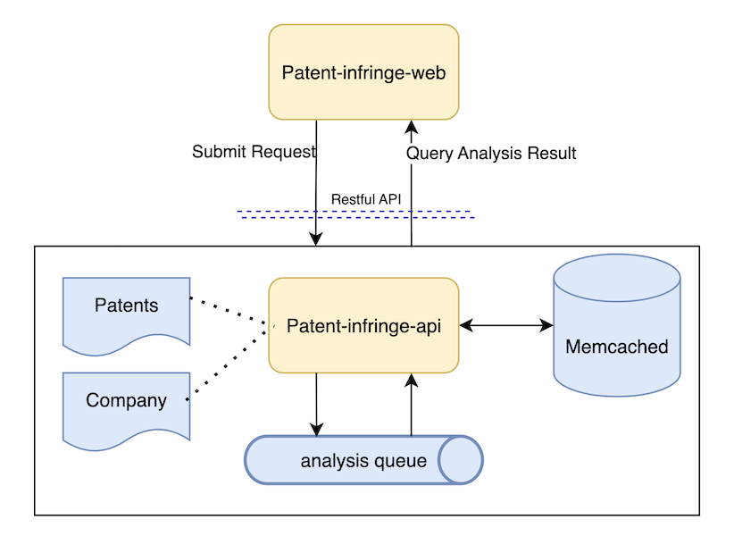

# Patent Infringement Analysis

This code project is built for Patent Infringement Analysis as one assessment homework.
Application of Patent Infringement Analysis is B/S structured web application.

This code project consists two sub-modules
- ***patent-infringe-web***, UI front-end application built by reactJS, Yarn, and TailwindCSS, refers to [details](https://github.com/SearocIsMe/patent-infring-web/blob/70c72d809bde115edff398e11e560d4339e85316/README.md)
- ***patent-infringe-API***, backend Resftful API service, built by Python, FastAI, OpenAI models, and others. kindly refer to [details](https://github.com/SearocIsMe/patent-infringe/blob/master/patent-infring-api/readme.md)

# Techincal Architecture
Below diagram shows the technical architecture of the application for Patent Infringement Analysis.

# How to Build and Run

This code proejct consists two sub modules
- ***patent-infring-web***, refer to [details](https://github.com/SearocIsMe/patent-infring-web/blob/70c72d809bde115edff398e11e560d4339e85316/README.md)
- ***patent-infring-api***, refer to [details](https://github.com/SearocIsMe/patent-infringe/blob/master/patent-infring-api/readme.md)

